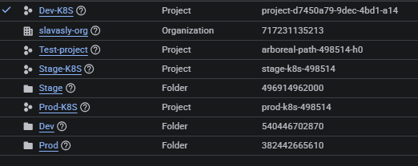
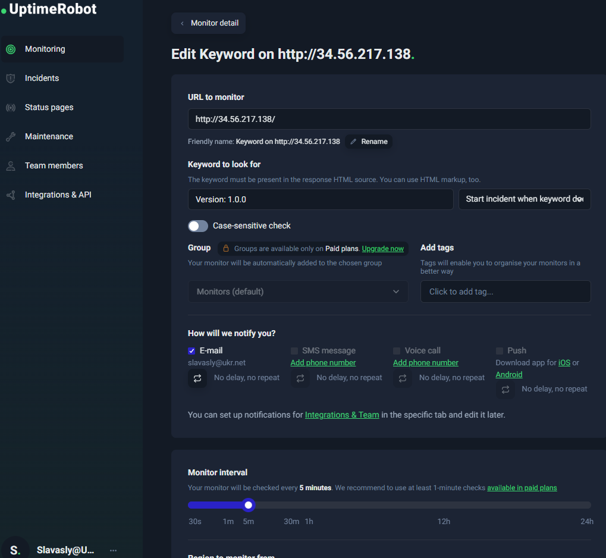
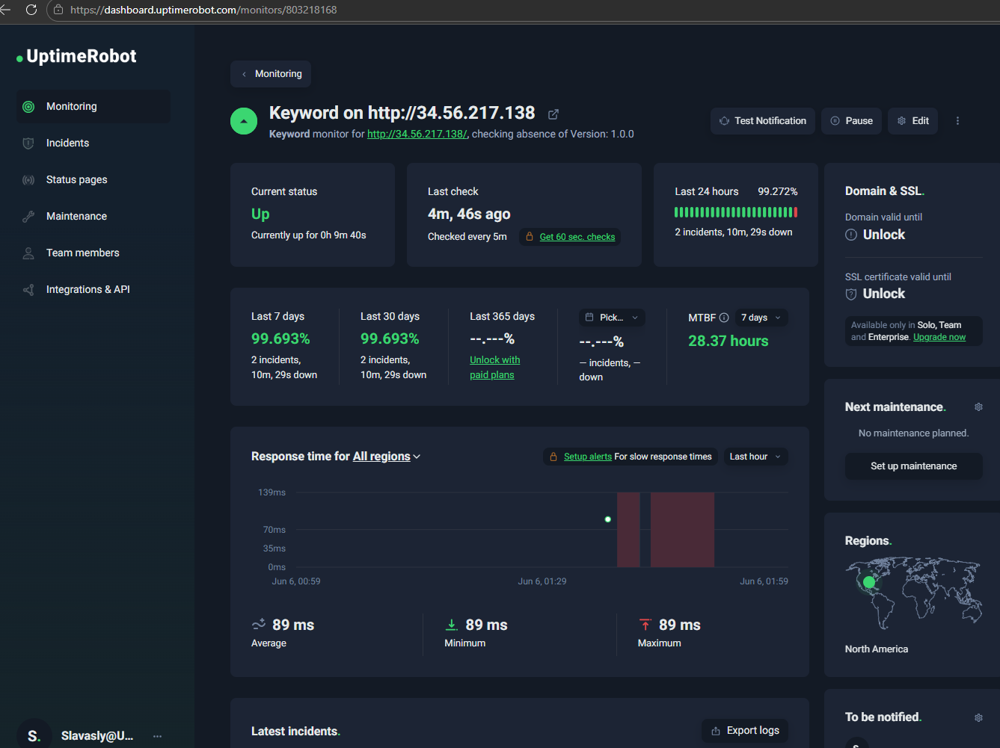
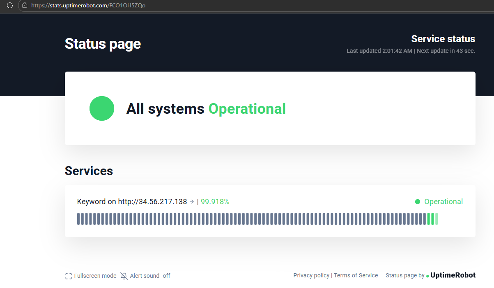
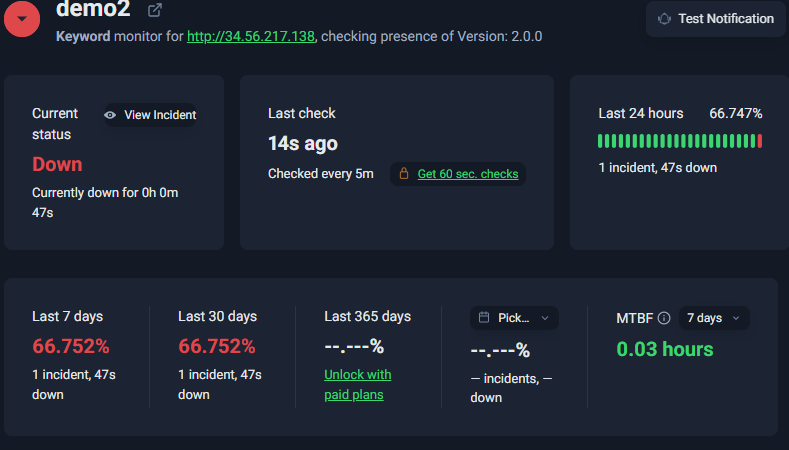
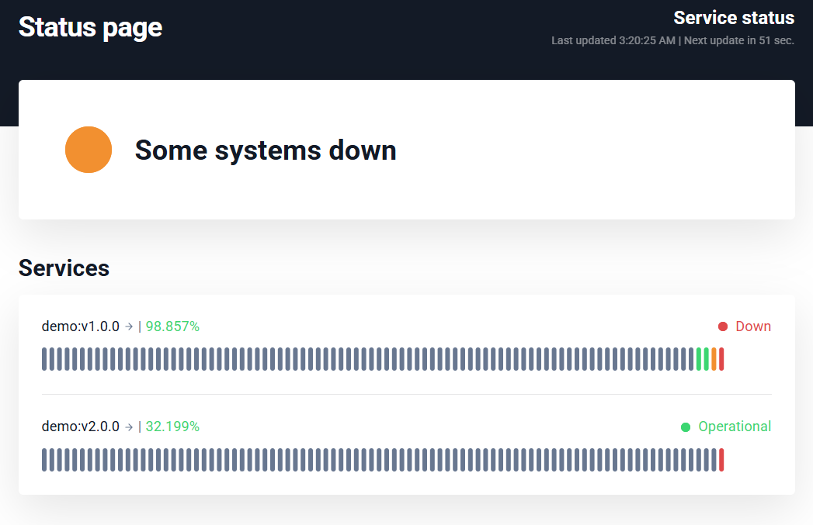

# Налаштування моніторингового сервісу Uptime Robot для застосунку в Kubernetes кластері на Google Cloud

## Задача 1

1. Розгорніть Kubernetes кластер на Google Cloud за допомогою gcloud cli
```sh
$ gcloud beta interactive # вмикаємо інтерактивний режим
gcloud config set project project-d7450a79-9dec-4bd1-a14 #встановлюємо проект по замовчуванню
$ gcloud container clusters create demo --zone us-central1-a --machine-type e2-medium --num-nodes 2 #запускаємо створення кластері в регіоні us-central

$ gcloud container clusters get-credentials demo --zone us-central1-a --project k8s
Fetching cluster endpoint and auth data.
kubeconfig entry generated for demo.

$ gcloud config set project k8s
Updated property [core/project].

$ gcloud container clusters list
NAME: demo
LOCATION: us-central1-a
MASTER_VERSION: 1.27.3-gke.100
MASTER_IP: 35.184.245.57
MACHINE_TYPE: e2-medium
NODE_VERSION: 1.27.3-gke.100
NUM_NODES: 2
STATUS: RUNNING
```

2. Після отримання доступу до кластеру, створіть deployment v1.0.0 що повертає версію “Version: 1.0.0”

```Dockerfile
FROM busybox 
CMD ["sh", "-c", "while true; do { echo -e 'HTTP/1.1 200 OK\n\n Version: 1.0.0'; } | nc -vlp 8080; done"]
EXPOSE 8080
```
```sh
$ docker build .
[+] Building 1.3s (5/5) FINISHED      

$ docker images
REPOSITORY   TAG       IMAGE ID       CREATED        SIZE
<none>       <none>    4c5fb224eac0    6.81MB       2.23MB

$ docker tag 4c5fb gcr.io/k8s/demo:v1.0.0
$ IMAGE                             ID             DISK USAGE   CONTENT SIZE   EXTRA
gcr.io/k8s/demo:v1.0.0   4c5fb224eac0       6.81MB         2.23MB  

$ docker images                                          
REPOSITORY                 TAG       IMAGE ID       CREATED        SIZE
gcr.io/k8s/demo:v1.0.0            4c5fb224eac0       6.81MB         2.23MB

$ k create deployment demo --image gcr.io/k8s-k3s/demo:v1.0.0
deployment.apps/demo created

$ k get deploy
NAME   READY   UP-TO-DATE   AVAILABLE   AGE
demo   1/1     1            1           8s

```

3. Налаштуйте сервіс типу LoadBalancer та отримайте IP-адресу

```sh
$ k create ns demo
namespace/demo created

$ k config set-context --current --namespace demo
Context "gke_project-d7450a79-9dec-4bd1-a14_us-central1-a_demo" modified.

$ k config current-context
gke_project-d7450a79-9dec-4bd1-a14_us-central1-a_demo

k get all
NAME                        READY   STATUS    RESTARTS   AGE
pod/demo-7db6689dd7-788kv   1/1     Running   0          4s

NAME                   READY   UP-TO-DATE   AVAILABLE   AGE
deployment.apps/demo   1/1     1            1           5s

NAME                              DESIRED   CURRENT   READY   AGE
replicaset.apps/demo-7db6689dd7   1         1         1       5s

$ k expose deployment demo --port 80 --type LoadBalancer --target-port 8080 
service/demo exposed

$ k get svc -w
NAME   TYPE           CLUSTER-IP       EXTERNAL-IP     PORT(S)        AGE
demo   LoadBalancer   34.118.229.228   34.56.217.138   80:30300/TCP   78s
$ 
$ curl 34.56.217.138
Version: 1.0.0

$ ping 35.232.233.124
PING 35.232.233.124 (35.232.233.124) 56(84) bytes of data.
64 bytes from 35.232.233.124: icmp_seq=1 ttl=105 time=102 ms

$ LB=$(k get svc demo -o jsonpath="{..ingress[0].ip}")
$ echo $LB
34.56.217.138
$ curl $LB
Version: 1.0.0
```

4. Налаштуйте Monitor Type Keyword у Uptime Robot вказавши IP-адресу балансера та Keyword “Version: 1.0.0”



5. Моніторингова система перевірить в реальному часі доступність першої версії



6. Налаштуйте публічну status page додавши до неї перший Monitoring

[](https://stats.uptimerobot.com/FCO1OH5ZQo)   


## Задача 2

7. Наступним кроком внесіть зміни у програму, збілдайте та запуште нову версію контейнеру у контейнер реєстр

```sh
$ nano Dockerfile 
$ docker build .

$ docker images
REPOSITORY                 TAG       IMAGE ID       CREATED        SIZE
gcr.io/k8s/demo   v1.0.0    c613587b7e6b   4 months ago   4.26MB
<none>                     <none>    a996fa979dcd   4 months ago   4.26MB

gcloud auth configure-docker us-west1-docker.pkg.dev --quiet
docker tag gcr.io/k8s-k3s/demo:v2.0.0 us-west1-docker.pkg.dev/project-d7450a79-9dec-4bd1-a14/k8s-k3s/demo:v2.0.0


$ docker tag a996fa979dcd gcr.io/k8s/demo:v2.0.0
$ docker images                                          
REPOSITORY                 TAG       IMAGE ID       CREATED        SIZE
gcr.io/k8s/demo   v1.0.0    c613587b7e6b   4 months ago   4.26MB
gcr.io/k8s/demo   v2.0.0    a996fa979dcd   4 months ago   4.26MB

$ docker push us-west1-docker.pkg.dev/project-d7450a79-9dec-4bd1-a14/k8s-k3s/demo:v2.0.0
```
8. Створить новий деплоймент з версію образу v2.0.0
```sh
$ k annotate deploy demo kubernetes.io/change-cause="create v1.0.0"

docker run us-west1-docker.pkg.dev/project-d7450a79-9dec-4bd1-a14/k8s-k3s/demo:v2.0.0

$ k create deployment demo2 --image gcr.io/k8s-k3s/demo:v2.0.0
deployment.apps/demo2 created

$ k get deploy
NAME    READY   UP-TO-DATE   AVAILABLE   AGE
demo    1/1     1            1           57m
demo2   1/1     1            1           31s

k annotate deploy demo kubernetes.io/change-cause="create v1.0.0"
deployment.apps/demo annotated

$ k annotate deploy demo2 kubernetes.io/change-cause="update to v2.0.0"
deployment.apps/demo2 annotated

$ k rollout history deploy
deployment.apps/demo 
REVISION  CHANGE-CAUSE
1         create v1.0.0

deployment.apps/demo2 
REVISION  CHANGE-CAUSE
1         update to v2.0.0
```

9. Переведіть трафік з першої на другу версію методами: Canary (25%) та Blue-Green (100%) Deployment

```sh
# Blue-Green (100%) Metod 1
$ k set image deploy demo demo=gcr.io/k8s/demo:v2.0.0
$ k set image deploy demo demo=gcr.io/k8s/demo:v1.0.0

while true; do curl $LB; sleep 0.3; done #Run continuous curl LB

$ k get pod --show-labels 
NAME                     READY   STATUS    RESTARTS   AGE     LABELS
demo-7db6689dd7-qnb9w    1/1     Running   0          4m51s   app=demo,pod-template-hash=7db6689dd7,topology.kubernetes.io/region=us-central1,topology.kubernetes.io/zone=us-central1-a
demo2-5578dc7974-r6h47   1/1     Running   0          20m     app=demo2,pod-template-hash=5578dc7974,topology.kubernetes.io/region=us-central1,topology.kubernetes.io/zone=us-central1-a

# Blue-Green (100%) Metod 2
k get svc -o wide
NAME   TYPE           CLUSTER-IP       EXTERNAL-IP     PORT(S)        AGE   SELECTOR
demo   LoadBalancer   34.118.229.228   34.56.217.138   80:30300/TCP   75m   app=demo

$ k edit svc demo
service/demo edited

$ k get svc -o wide
NAME   TYPE           CLUSTER-IP       EXTERNAL-IP     PORT(S)        AGE   SELECTOR
demo   LoadBalancer   34.118.229.228   34.56.217.138   80:30300/TCP   79m   app=demo2

#  Canary (25%) v2.0.0 - 5 pods, v2.0.0 - 15 pods
$ k scale deployment demo2 --replicas 5
deployment.apps/demo2 scaled
$ k get po -w
NAME                     READY   STATUS    RESTARTS   AGE
demo-7db6689dd7-qnb9w    1/1     Running   0          13m
demo2-5578dc7974-6vm9n   1/1     Running   0          26s
demo2-5578dc7974-dtc7x   1/1     Running   0          26s
demo2-5578dc7974-hm7zs   1/1     Running   0          26s
demo2-5578dc7974-mw9tk   1/1     Running   0          26s
demo2-5578dc7974-r6h47   1/1     Running   0          28m

$ k scale deployment demo --replicas 15
deployment.apps/demo scaled
$ k get po -w
NAME                     READY   STATUS    RESTARTS   AGE
demo-7db6689dd7-4d4p9    1/1     Running   0          4s
demo-7db6689dd7-5svmw    1/1     Running   0          4s
demo-7db6689dd7-9g6rr    1/1     Running   0          4s
demo-7db6689dd7-jgp5s    1/1     Running   0          4s
demo-7db6689dd7-khd4q    1/1     Running   0          4s
demo-7db6689dd7-m5ppr    1/1     Running   0          4s
demo-7db6689dd7-nj9f6    1/1     Running   0          4s
demo-7db6689dd7-nxz2j    1/1     Running   0          4s
demo-7db6689dd7-pmkdr    1/1     Running   0          4s
demo-7db6689dd7-q9bq9    1/1     Running   0          4s
demo-7db6689dd7-qnb9w    1/1     Running   0          14m
demo-7db6689dd7-twklv    1/1     Running   0          4s
demo-7db6689dd7-vzq2h    1/1     Running   0          4s
demo-7db6689dd7-xh4cd    1/1     Running   0          4s
demo-7db6689dd7-xk6z8    1/1     Running   0          4s
demo2-5578dc7974-6vm9n   1/1     Running   0          68s
demo2-5578dc7974-dtc7x   1/1     Running   0          68s
demo2-5578dc7974-hm7zs   1/1     Running   0          68s
demo2-5578dc7974-mw9tk   1/1     Running   0          68s
demo2-5578dc7974-r6h47   1/1     Running   0          29m

k get po -Lapp
NAME                     READY   STATUS    RESTARTS   AGE     APP
demo-7db6689dd7-4d4p9    1/1     Running   0          68s     demo
demo-7db6689dd7-5svmw    1/1     Running   0          68s     demo
demo-7db6689dd7-9g6rr    1/1     Running   0          68s     demo
demo-7db6689dd7-jgp5s    1/1     Running   0          68s     demo
demo-7db6689dd7-khd4q    1/1     Running   0          68s     demo
demo-7db6689dd7-m5ppr    1/1     Running   0          68s     demo
demo-7db6689dd7-nj9f6    1/1     Running   0          68s     demo
demo-7db6689dd7-nxz2j    1/1     Running   0          68s     demo
demo-7db6689dd7-pmkdr    1/1     Running   0          68s     demo
demo-7db6689dd7-q9bq9    1/1     Running   0          68s     demo
demo-7db6689dd7-qnb9w    1/1     Running   0          15m     demo
demo-7db6689dd7-twklv    1/1     Running   0          68s     demo
demo-7db6689dd7-vzq2h    1/1     Running   0          68s     demo
demo-7db6689dd7-xh4cd    1/1     Running   0          68s     demo
demo-7db6689dd7-xk6z8    1/1     Running   0          68s     demo
demo2-5578dc7974-6vm9n   1/1     Running   0          2m12s   demo2
demo2-5578dc7974-dtc7x   1/1     Running   0          2m12s   demo2
demo2-5578dc7974-hm7zs   1/1     Running   0          2m12s   demo2
demo2-5578dc7974-mw9tk   1/1     Running   0          2m12s   demo2
demo2-5578dc7974-r6h47   1/1     Running   0          30m     demo2

$ k label po --all run=demo

$ k get pod --show-labels  
NAME                     READY   STATUS    RESTARTS   AGE     LABELS
demo-6695d747b4-99c76    1/1     Running   0          76m     app=demo,pod-template-hash=6695d747b4,run=demo
# - - -
demo2-864f955495-xcx6h   1/1     Running   0          7m54s   app=demo2,pod-template-hash=864f955495,run=demo

$ k edit svc demo
```

10. По завершенню тестування, залишіть активною v2.0.0 на 100%
```sh
$k scale deployment demo --replicas 0
deployment.apps/demo scaled
$ k get po 
NAME                     READY   STATUS        RESTARTS   AGE
demo-7db6689dd7-4d4p9    1/1     Terminating   0          6m8s
demo-7db6689dd7-5svmw    1/1     Terminating   0          6m8s
demo-7db6689dd7-9g6rr    1/1     Terminating   0          6m8s
demo-7db6689dd7-jgp5s    1/1     Terminating   0          6m8s
demo-7db6689dd7-khd4q    1/1     Terminating   0          6m8s
demo-7db6689dd7-m5ppr    1/1     Terminating   0          6m8s
demo-7db6689dd7-nj9f6    1/1     Terminating   0          6m8s
demo-7db6689dd7-nxz2j    1/1     Terminating   0          6m8s
demo-7db6689dd7-pmkdr    1/1     Terminating   0          6m8s
demo-7db6689dd7-q9bq9    1/1     Terminating   0          6m8s
demo-7db6689dd7-qnb9w    1/1     Terminating   0          20m
demo-7db6689dd7-twklv    1/1     Terminating   0          6m8s
demo-7db6689dd7-vzq2h    1/1     Terminating   0          6m8s
demo-7db6689dd7-xh4cd    1/1     Terminating   0          6m8s
demo-7db6689dd7-xk6z8    1/1     Terminating   0          6m8s
demo2-5578dc7974-6vm9n   1/1     Running       0          7m12s
demo2-5578dc7974-dtc7x   1/1     Running       0          7m12s
demo2-5578dc7974-hm7zs   1/1     Running       0          7m12s
demo2-5578dc7974-mw9tk   1/1     Running       0          7m12s
demo2-5578dc7974-r6h47   1/1     Running       0          35m

$ k scale deployment demo2 --replicas 1
deployment.apps/demo2 scaled
$ k get po 
NAME                     READY   STATUS        RESTARTS   AGE
demo2-5578dc7974-6vm9n   1/1     Terminating   0          7m50s
demo2-5578dc7974-dtc7x   1/1     Running       0          7m50s
demo2-5578dc7974-hm7zs   1/1     Terminating   0          7m50s
demo2-5578dc7974-mw9tk   1/1     Terminating   0          7m50s
demo2-5578dc7974-r6h47   1/1     Terminating   0          36m

$ k get pod --show-labels 
NAME                     READY   STATUS    RESTARTS   AGE     LABELS
demo2-5578dc7974-dtc7x   1/1     Running   0          8m39s   app=demo2,pod-template-hash=5578dc7974,topology.kubernetes.io/region=us-central1,topology.kubernetes.io/zone=us-central1-a
```

11. Налаштуйте Monitor Type Keyword у Uptime Robot вказавши IP-адресу балансера та Keyword “Version: 2.0.0”


12. Моніторингова система перевірить в реальному часі доступність другої версії

13. Налаштуйте публічну status page додавши до неї другий Monitoring
[](https://stats.uptimerobot.com/FCO1OH5ZQo)   
https://stats.uptimerobot.com/FCO1OH5ZQo

## Зачистка:

```sh
$ gcloud container clusters delete demo --zone us-central1-a 
The following clusters will be deleted.
 - [demo] in [us-central1-a]

Do you want to continue (Y/n)?  y

Deleting cluster demo...done.                                                                                                                      
Deleted [https://container.googleapis.com/v1/projects/project-d7450a79-9dec-4bd1-a14/zones/us-central1-a/clusters/demo].

docker images
                                                                                                                                i Info →   U  In Use
IMAGE                                                                        ID             DISK USAGE   CONTENT SIZE   EXTRA
gcr.io/devops-55250/demo:v1.0.0                                              4c5fb224eac0       6.81MB         2.23MB        
gcr.io/k8s-k3s/demo:v2.0.0                                                   cd75edc3bbe1       6.81MB         2.23MB        
gcr.io/k8s/demo:v1.0.0                                                       4c5fb224eac0       6.81MB         2.23MB        
us-west1-docker.pkg.dev/project-d7450a79-9dec-4bd1-a14/k8s-k3s/demo:v1.0.0   2c2c0291d5f7       6.84MB         2.28MB    U   
us-west1-docker.pkg.dev/project-d7450a79-9dec-4bd1-a14/k8s-k3s/demo:v2.0.0   cd75edc3bbe1       6.81MB         2.23MB 

$ docker rmi -f 4c5fb224eac0 cd75edc3bbe1 4c5fb224eac0 
Untagged: gcr.io/devops-55250/demo:v1.0.0
Untagged: gcr.io/k8s/demo:v1.0.0
Deleted: sha256:4c5fb224eac0bac20d65fa05ddf7641899427e6a0b9a242cec21eee3a173f901
Untagged: gcr.io/k8s-k3s/demo:v2.0.0
Untagged: us-west1-docker.pkg.dev/project-d7450a79-9dec-4bd1-a14/k8s-k3s/demo:v2.0.0
Deleted: sha256:cd75edc3bbe1706c3fb055c764b2a4d5ac7df96d6f7d6a8168ed39fe2c9b1fae
Error response from daemon: No such image: 4c5fb224eac0:latest
```