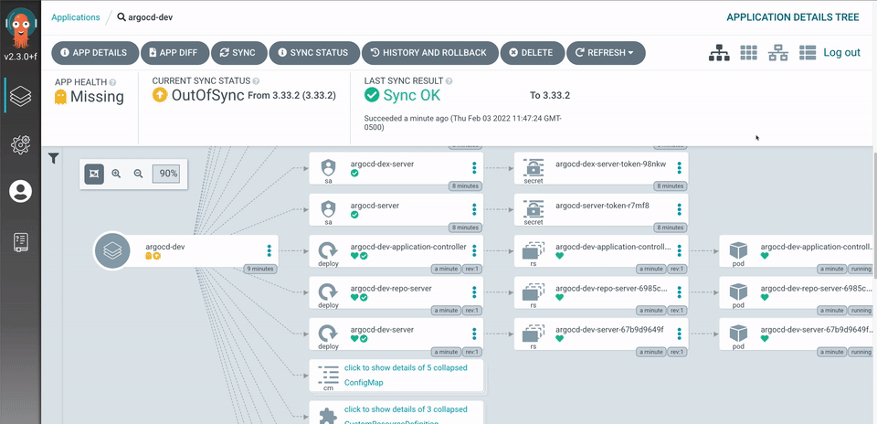
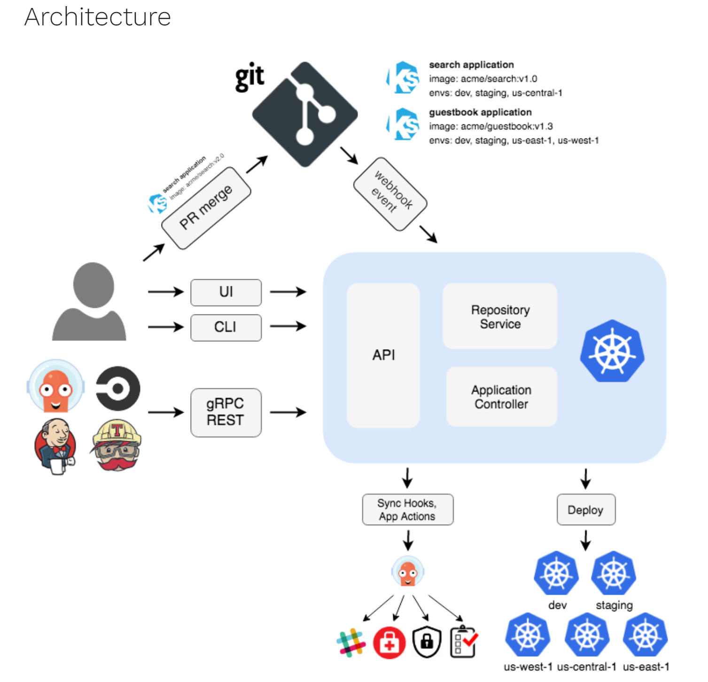
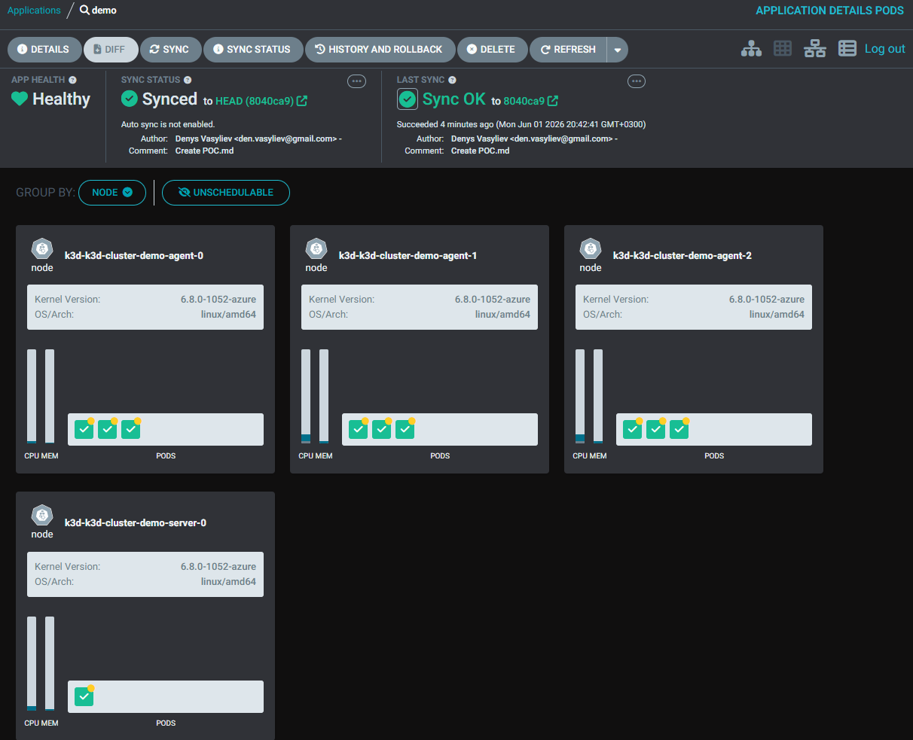

# Завдання 2

Пілотна версія «AsciiArtify» вже в розробці.

Команда погодилась з вашими аргументами та запросили підготувати Proof of Concept (PoC) по розгортанню GitOps-системи на рекомендованому вами варіанті Kubernetes. Командою запроповано продукт ArgoCD.

PoC — це етап, коли розробники перевіряють, чи є технічна можливість реалізувати концепцію продукту. На цьому етапі розробники використовують мінімальний набір функцій, щоб продемонструвати, що продукт може працювати та виконувати свої основні функції.

Вам потрібно практично розгорнути Kubernetes кластер за допомогою інструменту, що затверджений на етапі Concept. Встановити систему та налаштувати доступ команди до графічного інтерфейсу ArgoCD.

Основні кроки для підготовки та розгортанню ArgoCD на Kubernetes можна знайти у Coding Session.

Результатом завдання буде встановлена та налаштована система ArgoCD, готова до реалізації MVP.

Відповіддю на завдання буде посилання на репозиторій AsciiArtify (формат посилання: https://github.com/<username>/AsciiArtify) з демо-інструкцією на отримання доступу до інтерфейсу ArgoCD. Файл doc/POC.md у форматі Markdown, гілка main (Приклад демо з офіційного сайту — https://argo-cd.readthedocs.io/en/stable/)
 
# Реалізація:
https://argo-cd.readthedocs.io/en/stable/


 1. Розгортання Kubernetes‑кластера
Оскільки на етапі Concept ви затвердили k3d як інструмент для локального PoC, створюємо кластер:


````bash
k3d cluster create demo-cluster --servers 1 --agents 2
````
Перевіримо:
````bash
kubectl get nodes
````
2. Встановлення ArgoCD
ArgoCD розгортається у namespace argocd:

````bash
kubectl create namespace argocd
kubectl apply -n argocd -f https://raw.githubusercontent.com/argoproj/argo-cd/stable/manifests/install.yaml
````
Перевіримо поди:

````bash
kubectl get pods -n argocd
````
3. Доступ до веб‑інтерфейсу
ArgoCD за замовчуванням створює сервіс типу ClusterIP. Для PoC зручно зробити NodePort або port-forward:

**Варіант 1: Port‑forward**
````bash
kubectl port-forward svc/argocd-server -n argocd 8080:443
````
→ відкриваєш у браузері: https://localhost:8080

**Варіант 2: NodePort**
````bash
kubectl patch svc argocd-server -n argocd -p '{"spec": {"type": "NodePort"}}'
kubectl get svc -n argocd
````
→ отримаєш зовнішній порт, наприклад https://<NodeIP>:<NodePort>

4. Отримання пароля адміністратора
ArgoCD генерує пароль у secret:

````bash
kubectl -n argocd get secret argocd-initial-admin-secret -o jsonpath="{.data.password}" | base64 -d
````
→ логін: admin, пароль: значення з команди.

5. Перевірка доступу
Відкриваєш веб‑інтерфейс ArgoCD.

Логін: admin / <пароль>

Додаєш репозиторій Git і створюєш перший Application для демонстрації GitOps‑циклу.

Change port Type to NodePort

Payload Image:
