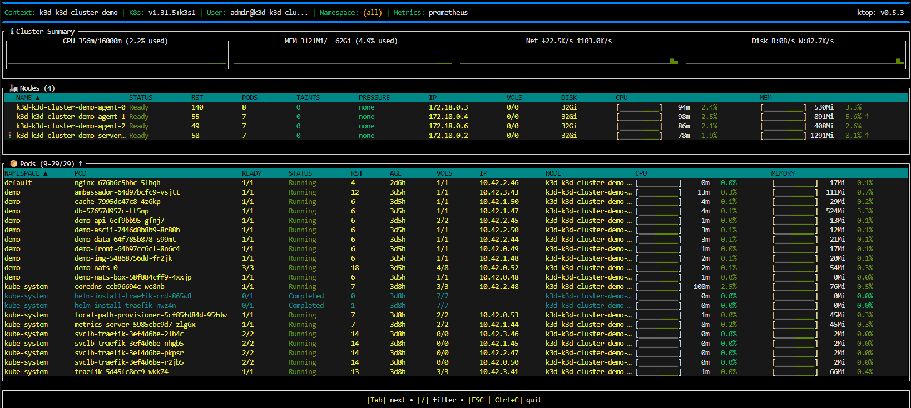

# Розширення kubectl (Extending kubectl)
1.  Встановимо Krew — це менеджер плагінів для kubectl (щось типу apt, brew або pip, але суто для кубера). https://krew.sigs.k8s.io/docs/user-guide/setup/install/
- Запусти цей скрипт у своєму терміналі. Він завантажить актуальну версію krew, розпакує її та запустить інсталяцію:

````Bash
(
  set -x; cd "$(mktemp -d)" &&
  OS="$(uname | tr '[:upper:]' '[:lower:]')" &&
  ARCH="$(uname -m | sed -e 's/x86_64/amd64/' -e 's/\(arm\)\(64\)\?.*/\1\2/' -e 's/aarch64/arm64/')" &&
  KREW="krew-${OS}_${ARCH}" &&
  curl -fsSLO "https://github.com/kubernetes-sigs/krew/releases/latest/download/${KREW}.tar.gz" &&
  tar -zxvf "${KREW}.tar.gz" &&
  ./"${KREW}" install krew
)
````
- додати `export PATH="${KREW_ROOT:-$HOME/.krew}/bin:$PATH"` до профіля bashrc
**nano ~/.bashrc**
- and restart your shell:
`sudo exec ~/.bashrc` or `source ~/.bashrc`
- run krew
```
k krew
krew is the kubectl plugin manager.
You can invoke krew through kubectl: "kubectl krew [command]..."

Usage:
  kubectl krew [command]

Available Commands:
  help        Help about any command
  index       Manage custom plugin indexes
```
2. Install ns plugin for Switch between Kubernetes namespaces:
``` 
k krew install ns
Updated the local copy of plugin index.
Installing plugin: ns
Installed plugin: ns
\
 | Use this plugin:
 |      kubectl ns
 | Documentation:
 |      https://github.com/ahmetb/kubectx
 | Caveats:
 | \
 |  | If fzf is installed on your machine, you can interactively choose
 |  | between the entries using the arrow keys, or by fuzzy searching
 |  | as you type.
 | /
/
WARNING: You installed plugin "ns" from the krew-index plugin repository.
   These plugins are not audited for security by the Krew maintainers.
   Run them at your own risk.

k ns # Show all namespaces
argocd
default
demo
kube-node-lease
kube-public
kube-system

kubectl plugin list # Show installed plugins
Unable to read directory "/usr/local/sdkman/candidates/ant/current/bin" from your PATH: open /usr/local/sdkman/candidates/ant/current/bin: no such file or directory. Skipping...
Unable to read directory "/usr/local/rvm/gems/default@global/bin" from your PATH: open /usr/local/rvm/gems/default@global/bin: no such file or directory. Skipping...
Unable to read directory "/home/codespace/.dotnet/tools" from your PATH: open /home/codespace/.dotnet/tools: no such file or directory. Skipping...
The following compatible plugins are available:

/home/codespace/.krew/bin/kubectl-krew
/home/codespace/.krew/bin/kubectl-ns
```
3. Створимо структуру папок та додамо скрипт:

```
mkdir -p scripts

touch scripts/kubeplugin
```
Script file
```
#!/bin/bash

# Define command-line arguments

RESOURCE_TYPE=$1

# Retrieve resource usage statistics from Kubernetes
kubectl $2 $RESOURCE_TYPE -n $1 | tail -n +2 | while read line
do
  # Extract CPU and memory usage from the output
  NAME=$(echo $line | awk '{print $1}')
  CPU=$(echo $line | awk '{print $2}')
  MEMORY=$(echo $line | awk '{print $3}')

  # Output the statistics to the console
  # "Resource, Namespace, Name, CPU, Memory"
done
```
- створимо скрипт за зробимо його запускним  
ls -la scripts/kubeplugin  
-rw-rw-rw- 1 codespace codespace 444 Jun  4 22:33 scripts/kubeplugin  
chmod 755 scripts/kubeplugin  
ls -la scripts/kubeplugin 
-rwxr-xr-x 1 codespace codespace 444 Jun  4 22:33 scripts/kubeplugin

- скопіюємо новий плагін в локальну директорію користувача PATH: згідно [інструкції](https://kubernetes.io/docs/tasks/extend-kubectl/kubectl-plugins/)

```sh
$ sudo cp ./kubeplugin /usr/local/bin/kubectl-kubeplugin
k plugin list #Плагін додався в список

/home/codespace/.krew/bin/kubectl-krew  
/home/codespace/.krew/bin/kubectl-ns  
/usr/local/bin/kubectl-kubeplugin  
```
4. Встановлюємо ktop https://github.com/vladimirvivien/ktop  
A top-like tool for your Kubernetes cluster. 
Following the tradition of Unix/Linux top tools, ktop is a tool that displays useful metrics information about nodes, pods, and other workload resources running in a Kubernetes cluster.
```
kubectl krew install ktop
kubectl ktop
```
 

5. Рефакторінг скрипта:

Ти використовуєш $1 і для namespace, і для resource type одночасно. Це конфлікт.

$2 використовується як команда (get чи top), але порядок аргументів не визначений.

У циклі while read line ти витягуєш поля через awk, але не виводиш результат.

В кінці скрипта є done# без пробілу — це синтаксична помилка.
```
#!/bin/bash
# Usage: ./kubeplugin.sh <command> <resource_type> <namespace>
# Example: ./kubeplugin.sh get pods default

# Define command-line arguments

COMMAND=$1 # перший аргумент після назви скрипта
RESOURCE_TYPE=$2 # другий аргумент
NAMESPACE=$3 # третій аргумент

# Retrieve resource usage statistics from Kubernetes
kubectl $COMMAND $RESOURCE_TYPE -n $NAMESPACE | tail -n +2 | while read line
do
  # Extract CPU and memory usage from the output
  NAME=$(echo $line | awk '{print $1}')
  CPU=$(echo $line | awk '{print $2}')
  MEMORY=$(echo $line | awk '{print $3}')

  # Output the statistics to the console
  echo "Resource: $RESOURCE_TYPE | Namespace: $NAMESPACE | Name: $NAME | CPU: $CPU | Memory: $MEMORY"
done
```
6. Запуск та приклади використання:
# Usage: ./kubeplugin.sh <command> <resource_type> <namespace>
# Example: ./kubeplugin.sh get pods default

``` kubeplugin top no argocd
Resource: no | Namespace: argocd | Name: k3d-k3d-cluster-demo-agent-0 | CPU: 68m | Memory: 1%
Resource: no | Namespace: argocd | Name: k3d-k3d-cluster-demo-agent-1 | CPU: 63m | Memory: 1%
Resource: no | Namespace: argocd | Name: k3d-k3d-cluster-demo-agent-2 | CPU: 62m | Memory: 1%
Resource: no | Namespace: argocd | Name: k3d-k3d-cluster-demo-server-0 | CPU: 68m | Memory: 1%

k kubeplugin top po argocd
Resource: po | Namespace: argocd | Name: argocd-application-controller-0 | CPU: 5m | Memory: 119Mi
Resource: po | Namespace: argocd | Name: argocd-dex-server-69589d76c9-k2trq | CPU: 1m | Memory: 125Mi
Resource: po | Namespace: argocd | Name: argocd-notifications-controller-84574f95c9-fzzd8 | CPU: 1m | Memory: 37Mi
Resource: po | Namespace: argocd | Name: argocd-redis-6f9db9df8f-jtcx6 | CPU: 4m | Memory: 7Mi
Resource: po | Namespace: argocd | Name: argocd-repo-server-6fc8c9bcbf-wbzbw | CPU: 1m | Memory: 90Mi
Resource: po | Namespace: argocd | Name: argocd-server-7b64599fb8-8nzjq | CPU: 1m | Memory: 87Mi
```